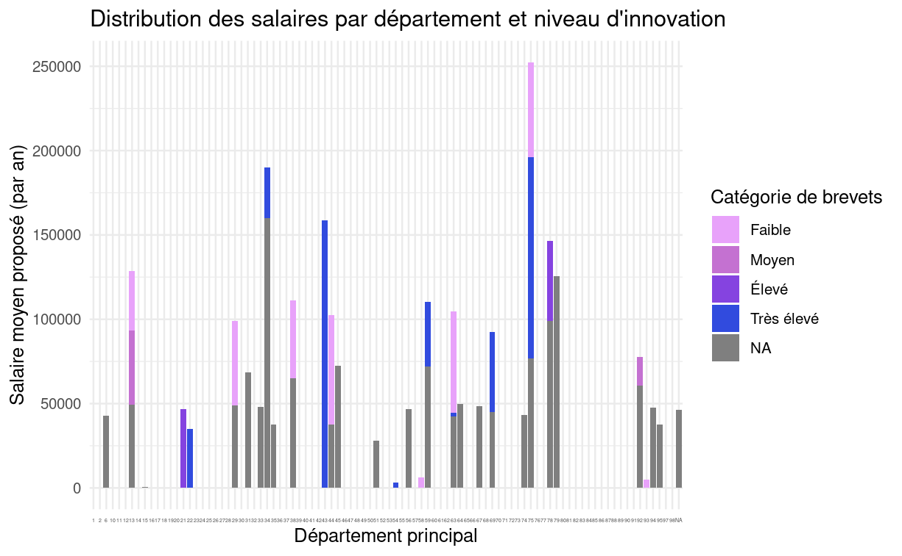
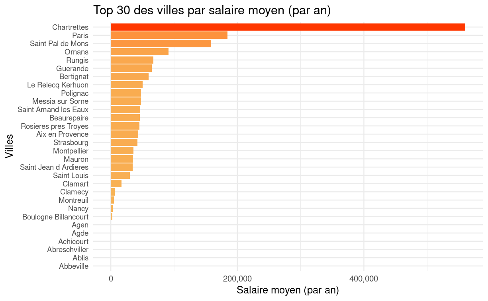
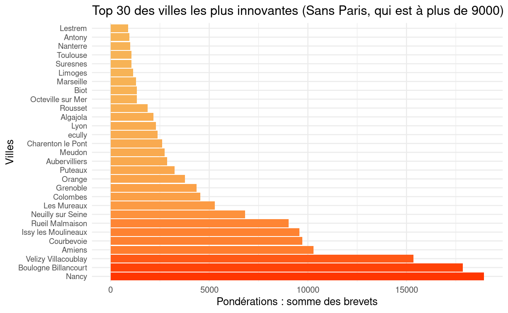
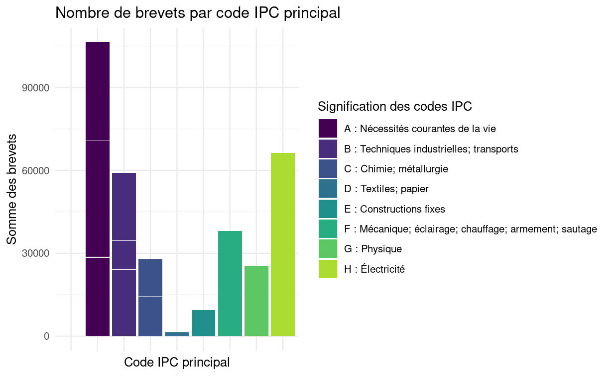
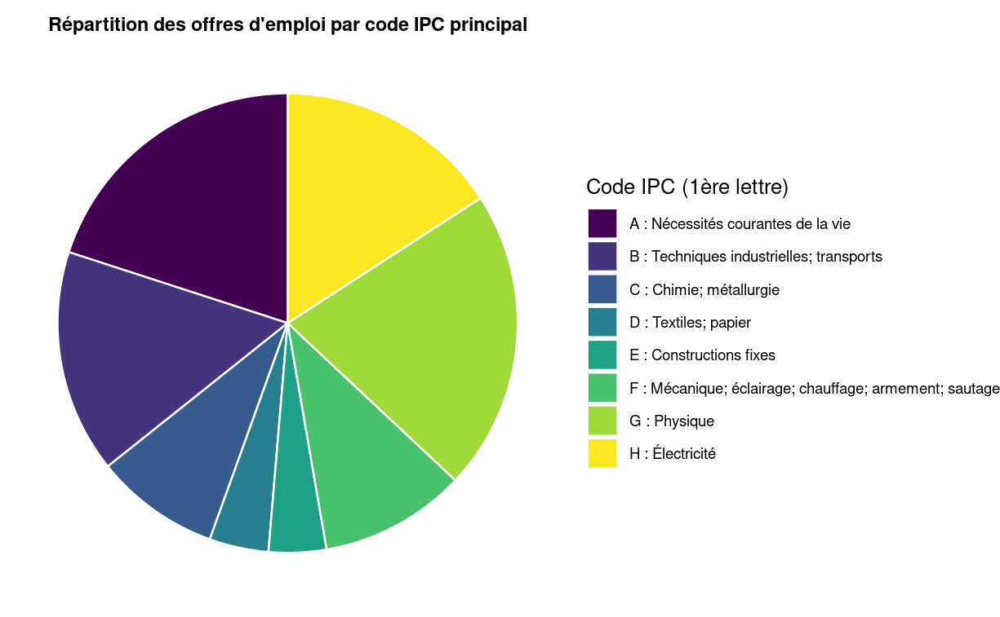
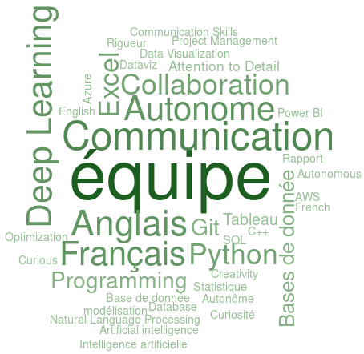

# **Analyse des données**

## Analyse des salaires

Les travaux les plus ambitieux ne peuvent être accomplis seul. Nous pouvons observer que la capacité à travailler en équipe est particulièrement valorisée, puisque "équipe" est la compétence la plus rémunérée. Vient ensuite le capacité à communiquer en anglais, qui appuie l'esprit d'équipe en ouvrant la collaboration à l'internationale. 
De multiples langages tels que Python ou SQL sont également demandés, ainsi que Git qui renvoit encore une fois à l'esprit d'équipe.

## Dépôts de brevet
<!-- n_patents -->

<!-- IPC -->

	
<!-- compétence -->

