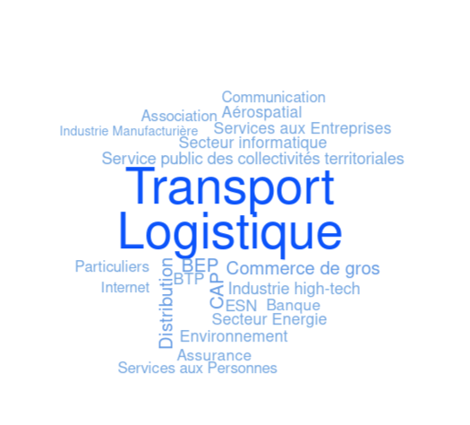
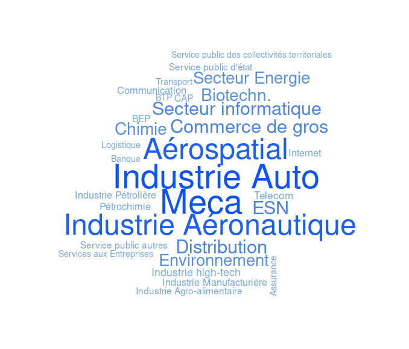
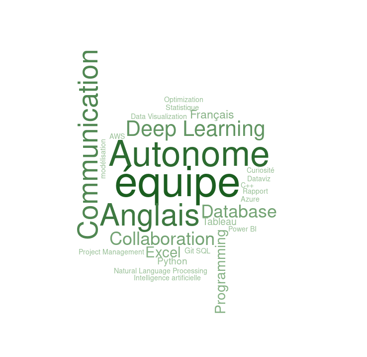
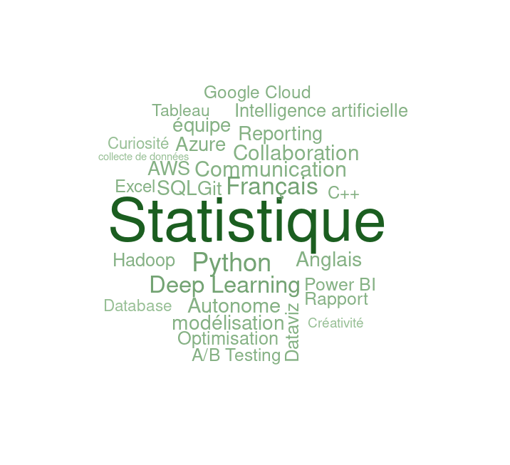

 # **Analyse des données**

  
  

&nbsp; &nbsp; &nbsp; &nbsp; &nbsp; &nbsp; &nbsp; &nbsp; &nbsp; &nbsp; &nbsp; &nbsp; &nbsp; &nbsp; **Secteurs pondérés par le salaire moyen** &nbsp; &nbsp; &nbsp; &nbsp; &nbsp; &nbsp; &nbsp; &nbsp; &nbsp; &nbsp; &nbsp; &nbsp; &nbsp; &nbsp; &nbsp; &nbsp; &nbsp; &nbsp; &nbsp; &nbsp; &nbsp; &nbsp; &nbsp; &nbsp; &nbsp; **Secteurs pondérés par l'innovation**

   

Analyse du premier wordcloud (secteurs pondérés par les salaires) : 
- Pour ce premier wordcloud, les secteurs "Transport" et "Logistique" dominent largement, ils sont donc identifiés comme offrant des salaires compétitifs.
En effet, les secteurs liés à la gestion et à la chaîne d'approvisionnement (logistique, transport, distribution) sont mis en avant, démontrant une forte valorisation salariale. Cela peut être dû à la demande croissante pour ces secteurs dans une économie mondialisée.

 

Analyse du deuxième wordcloud (secteurs pondérés par les brevets - innovation) :
- Pour ce deuxième wordcloud nous remarquons une plus grande diversité au sujet des secteurs mis en avant. Les termes "Industrie Auto", "Industrie Aéronautique", "Mécanique (Meca)" et "Aérospatial" ressortent comme les leaders en innovation. Nous observons également des secteurs comme "Chimie", "Biotechnologie" et "Secteur Informatique", qui sont bien représentés, reflétant leur forte orientation vers la recherche et le développement. Nous pouvons en conclure que les secteurs industriels et technologiques sont les moteurs de l'innovation, où l'effort en R&D conduit à la production de brevets.

 

Conclusion
- Le premier wordcloud met davantage l'accent sur des secteurs orientés vers les services (ex. Logistique, Services aux entreprises).
tandis que le deuxième wordcloud valorise des secteurs orientés vers l'industrie et la technologie (ex. Aérospatial, Biotechnologie, Mécanique).
Le transport et la logistique, dominants pour les salaires, sont beaucoup moins représentés en termes d'innovation, tandis que des secteurs comme l'automobile et l'aéronautique sont les leaders en innovation mais moins proéminents en termes de salaires.
- Pour un professionnel ou une entreprise, investir dans l'innovation dans des secteurs technologiques est clé pour rester compétitif sur le long terme. Cependant, les secteurs logistiques et de transport peuvent offrir des opportunités financières immédiates. Un équilibre entre innovation et valeur économique peut être trouvé dans des secteurs comme l'aéronautique, qui figurent dans les deux dimensions.

   

  
  

&nbsp; &nbsp; &nbsp; &nbsp; &nbsp; &nbsp; &nbsp; &nbsp; &nbsp; &nbsp; &nbsp; &nbsp; &nbsp; &nbsp; **Compétences pondérés par l'innovation** &nbsp; &nbsp; &nbsp; &nbsp; &nbsp; &nbsp; &nbsp; &nbsp; &nbsp; &nbsp; &nbsp; &nbsp; &nbsp; &nbsp; &nbsp; &nbsp; &nbsp; &nbsp; &nbsp; **Compétences pondérés par le salaire moyen**

   

Analyse du premier wordcloud (compétences pondérées par les brevets - innovation)
- Ce wordcloud met en avant des compétences techniques et comportementales qui distinguent l'innovation. L'association de l'autonomie avec la collaboration en équipe montre une importance de l'équilibre entre le travail individuel et collectif pour générer de nouvelles idées. Par ailleurs, la présence de « Deep Learning » et de « modélisation » indique que l'innovation se concentre sur des compétences en intelligence artificielle et en analyse de données, ce qui reflète très bien le contenu de nos données.

 

Analyse du deuxième wordcloud (compétences pondérées par le salaire moyen)
- Sur ce wordcloud le terme "Statistique" domine largement, suivi de "Deep Learning", "Python" et "modélisation". Nous en déduisons aisément que les compétences mieux rémunérées se concentrent sur des compétences techniques spécifiques, notamment dans les domaines des données et du cloud.

 

Comparaison :
- En prenant en compte les deux wordclouds nous pouvons relever que les compétences en Deep Learning et autonomie apparaissent dans les deux, confirmant leur importance à la fois pour l'innovation et pour les salaires élevés. Les compétences en collaboration d'équipe et communication sont également partagées, soulignant leur transversalité. Ces compétences semblent donc primordiales que ce soit pour atteindre des salaires conséquents ou bien performer dans l'innovation.
- Cependant, il y a tout de même des différences notables puisque, le wordcloud pondérés par les brevets mets plus d'accent sur des qualités générales comme "Autonome" et "équipe" tandis que dans le wordcloud pondéré par les salaires il y a une forte mise en avant de "Statistique", "Python" et des outils liés aux bases de données et au cloud, des compétences plus techniques et spécialisées.
Les brevets mettent davantage l'accent sur l'impact collectif ou comportemental, tandis que les salaires mettent en valeur des compétences directement monétisables et techniques. 

Conclusion
- Les compétences techniques comme le "Deep Learning" et les outils cloud sont cruciaux à la fois pour innover et pour obtenir un salaire élevé. Cependant, l'innovation semble exiger un équilibre entre soft skills (autonomie, communication) et techniques, tandis que le salaire est davantage lié à une spécialisation technique pointue.
Pour maximiser à la fois innovation et rémunération, une combinaison de compétences techniques avancées (ex. Python, Deep Learning, statistique) et de compétences comportementales (ex. communication, collaboration) est essentielle. Cela met en avant l'importance d'un profil hybride capable de créer de la valeur dans les deux dimensions.

CONCERNANT LES CODES IPC (3 GRAPHIQUES) : 

1. Salaires moyens par code IPC
- Les catégories A (Nécessités courantes de la vie), H (Électricité), et D (Textiles, papier) affichent des salaires moyens largement plus élevés que pour les autres catégories.
Les secteurs comme E (Constructions fixes) et F (Mécanique, éclairage, chauffage), bien que représentant des domaines techniques importants, montrent des salaires plus modestes.
Cela indique que les métiers liés aux domaines essentiels ou technologiques avancés (comme l’électricité) offrent de meilleures rémunérations.

2. Répartition des offres d’emploi par code IPC
- La répartition montre une forte concentration des offres dans les catégories A (Nécessités courantes de la vie) et H (Électricité), reflétant leur poids économique.
Les catégories comme D (Textiles, papier) et E (Constructions fixes) ont une faible part des offres, suggérant une spécialisation plus limitée ou une demande réduite.
Ce graphique ne prend cependant pas en compte la plupart des entreprises pour lesquelles nous n'avions pas de données sur les codes IPC, cela représente plus de 50% des entreprises. 

3. Nombre de brevets par code IPC
- Les brevets sont largement dominés par les catégories A (Nécessités courantes de la vie), H (Électricité), et B (Techniques industrielles, transports).
- Ces catégories reflètent des domaines où l’innovation est particulièrement active, répondant à des besoins fondamentaux (catégorie A) ou soutenant des secteurs technologiques et industriels clés (catégories B et H).
- La catégorie G (Physique) et d'autres domaines techniques suivent, mais avec un volume de brevets moindre comparé aux trois catégories dominantes.
- Les catégories A et H se démarquent non seulement par leur volume élevé de brevets, mais également par leurs salaires moyens très élevés, montrant une forte valorisation de ces secteurs sur le marché du travail. En revanche, la catégorie B, bien qu’innovante, ne figure pas parmi les secteurs offrant les rémunérations les plus élevées.

Conclusion

L’analyse des salaires, des offres d’emploi et des brevets par code IPC met en lumière des dynamiques intéressantes :
- Les catégories A (Nécessités courantes de la vie) et H (Électricité) se distinguent comme des secteurs particulièrement valorisés, combinant des salaires moyens très élevés, une forte demande sur le marché de l’emploi, et un volume important de brevets. Cela reflète leur double rôle économique, à la fois dans la satisfaction des besoins essentiels et dans les avancées technologiques.
- La catégorie B (Techniques industrielles, transports), bien qu’innovante avec un grand nombre de brevets, n’offre pas des rémunérations aussi élevées, suggérant une valorisation plus technologique qu’économique sur le marché.
- Les catégories E (Constructions fixes) et F (Mécanique, éclairage, chauffage), pourtant fondamentales dans les infrastructures et l’industrie, montrent une présence plus modeste en termes de salaires et d’offres d’emploi, ce qui peut s’expliquer par une spécialisation plus restreinte ou une dynamique de marché différente.
- Enfin, la proportion importante d’entreprises sans données IPC (plus de 50 %) souligne une limite dans l’analyse des offres d’emploi, mais n’affecte pas les tendances générales observées dans les secteurs bien représentés.

GRAPHIQUES EN BARRE AU SUJET DES VILLES : 

Constat général : Les deux graphiques montrent des disparités significatives entre les villes en termes de salaires moyens et d’innovation (pondérée par le nombre de brevets). Paris se démarque dans les deux contextes, mais est exclue du graphique des brevets pour permettre une meilleure lecture des autres villes.

Top 30 des villes par salaires moyens :

- Chartrettes occupe une position exceptionnelle, avec un salaire moyen bien au-dessus des autres villes. Cependant, comme à l'habitude, les données concernant les salaires étant peu présentent, il faut conserver un esprit critique envers ces résultats.
Les villes comme Paris, Saint-Pal-de-Mons, et Ornans suivent, soulignant un équilibre entre zones urbaines et rurales.
Les données révèlent une distribution géographique variée, avec des villes de différentes tailles représentées.

Top 30 des villes les plus innovantes :

- Les villes industrielles ou fortement technologiques comme Nancy, Boulogne-Billancourt, et Vélizy-Villacoublay dominent, avec un grand nombre de brevets déposés.
On note une forte représentation des villes proches de grands centres économiques ou technologiques (par exemple, Grenoble pour la recherche technologique, Amiens pour les industries).
Contrairement au graphique des salaires, l’innovation semble davantage concentrée dans des zones spécifiques, souvent liées à des écosystèmes industriels.

Conclusion :

- Les villes offrant les salaires moyens les plus élevés ne sont pas toujours les plus innovantes, suggérant que l’innovation et la rémunération ne sont pas systématiquement corrélées.
Les salaires élevés sont répartis de manière plus homogène entre les différentes régions, tandis que l’innovation est concentrée dans des pôles technologiques et industriels bien définis.

GRAPHIQUE DISTRIBUTION DES SALAIRES PAR DEPARTEMENT ET NIVEAU D'INNOVATION (VIOLET) :

- Dans ce graphique nous pouvons voir que les salaires varient considérablement selon les départements, mais Paris (75) domine largement avec un salaire moyen supérieur à 120 000 euros par an, en moyenne.
D'autres départements, tels que Lyon (69) et probablement des métropoles dynamiques comme Toulouse (31), se démarquent par des salaires compétitifs, bien qu'ils restent loin de Paris.
- Les départements avec un grand nombre de brevets (bleu) ne montrent pas systématiquement des salaires plus élevés que ceux ayant un niveau d'innovation faible (rose clair). Certains départements ayant peu de brevets affichent des salaires moyens compétitifs, suggérant que d'autres facteurs influencent davantage la rémunération (économie locale, type d'industrie, structure des emplois, etc.).
- Il est important de souligner que Paris (75), étant la capitale de la France, est un cas unique avec une concentration importante d'entreprises et d'opportunités à haute rémunération.
- Lyon (69) et d'autres départements dynamiques présentent également une combinaison favorable d'opportunités d'emploi bien rémunérées.

- Ce graphique met en évidence qu'il ne semble pas avoir de corrélation directe et systématique entre le niveau d'innovation (mesuré par les brevets) et les salaires. Cependant, il est important de préciser que parmis les données que nous avons traiter il manquait régulièrement des informations concernant les salaires et les nombres de brevets déposés ce qui peut limiter l'apparition de corrélation entre ces données. 

- Ici, les différences salariales semblent être davantage liées à la concentration économique, à la structure des industries locales, et à la taille du marché de l'emploi (avec Paris en tête, suivi de Lyon). L'innovation, bien qu'importante, ne joue pas un rôle central et pourrait être un facteur parmi d'autres, elle ne suffit pas pour expliquer les écarts salariaux significatifs observés dans ce graphique.

